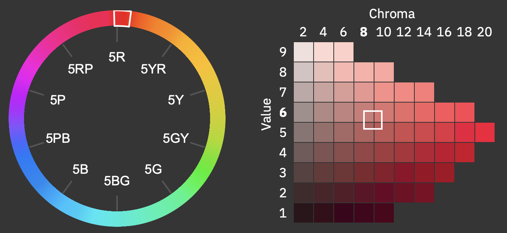
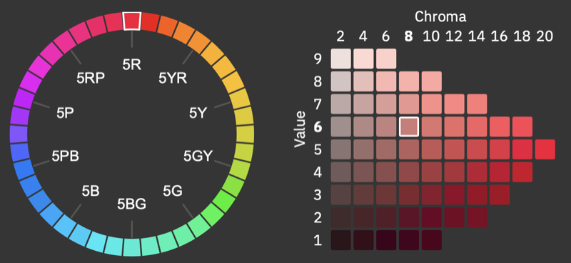

# Color Metrics

The color of a fancy stone is described using **Munsell notation**, which defines three attributes: **Hue (H), Value (V), and Chroma (C)**.  

The notation format is: **H V/C**.  
Examples: **7.5R 6/4**, **8.2BG 5.3/3.4**.  

The Munsell system represents 40 Hues arranged on a circle. Each Hue corresponds either to one of the five primary colors or to a mixture of two adjacent ones.  
The primary colors are: **Red, Yellow, Green, Blue, and Purple**.  

The following fields are used to describe the color:  

* **`HVC` (string)** – exact Munsell coordinates, which may include fractional values. This specifies the precise position of the color between tabular Munsell chips as defined in the *Munsell Book of Color*. 
* **`nearestHVC` (string)** – the Munsell coordinates of the closest tabular chip to the precise `HVC`.  
* **`hueAngleDeg` (float)** – the angular position of the Hue on the Munsell circle, in degrees. A value of **0** corresponds to the beginning of the **2.5R** segment. The positive direction follows the sequence: **Red → Yellow → Green → Blue → Purple**.  

The diagrams below illustrate the positions of exact Munsell coordinates and their nearest tabular chip.  

  
  

