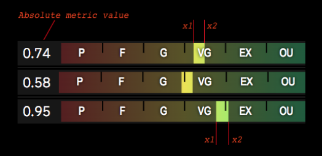
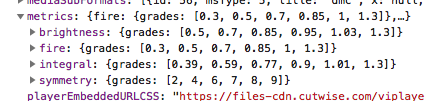
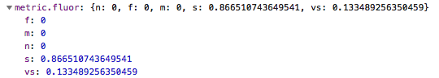
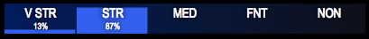

# Cutwise Scores Scale

## Overview

Scores scale format described below is actual for the following Cutwise Scores: _Fire_, _Brilliance_, _Cut Performance_.

List of used attributes:

- `score.val` — absolute score value (is not normalized  to mass or area);
- `score.rg` — relative grade value (normalized by Round cut with the same projection area);
- `score.d` — calculation error (dispersion).

The position and width of the **Score Scale Marker** on the scale is defined by the boundaries `x1` and `x2` (see image below and _Score Scale Marker bounding_ section).

The entire space in the boundaries is painted with a more saturated gradient background. This area is called **Score Scale Marker**.

Absolute scores are showed as is.



## Score Scale Marker Bounding

```
x1 = score.rg - score.d;
x2 = score.rg + score.d;
```

The positions of both `x1` and `x2` points are interpolated separately on definite scale segment that each point is fitted to. Both bounds can fit into one segment.

## Score Scale Segments

The list of segment boundaries is defined in the [Constants API](constants-api.md)



⚠️ Lower poor grade bound is always 0.

⚠️ Actually there is no upper limit for OU (grade Outstanding), the last scale value in the API (for example, 1.3 for Fire) is used just for the convenient normalization to the OU grade (so as not to normalize between 1 and infinity). If the grade value is greater than the upper segment, then we assume it to be equal to the OU segment boundary.

## Example for Fire Score

```
score.rg = 0.73
score.d = 0.05
x1 = 0.68
x2 = 0.78
```

`x1` is located between the second (0.5) and third (0.7) boundaries of the scale segments and positioned by linear interpolation closer to the 0.7 boundary.

`x2` is located between the third (0.7) and fourth (0.85) boundaries of the segments on the scale and positioned by linear interpolation approximately in the middle of the segment.

On the graphical representation of the scale, the grade marker should be 20% on the right side of the G segment (grade Good) and 53% from on the left side of the VG segment (grade Very Good).

⚠️ For positioning the Symmetry Score marker, the same scheme is used but instead of relative grade (`*.rg`) the absolute value (`* .val`) is used.

## Spread scores

```
"spread": {
  "ct": -0.19,
  "pc": -14.2,
  "d": 0.1,
  "ver": "1.0.0"
}
```

About Octonus Spread parameter please read https://www.octonus.com/oct/products/3dcalc/standard/param17.phtml .

`spread.ct` — absolute spread (carats).
`spread.pc` — relative spread (%).
`d` is metric accuracy for `spread.pc`.

## Fluorescence Scores

Fluorescence Scores values appears as a histogram values:



The values lie in the range `[0;1]`, where 1 is the maximum value (100%).

Fluorescence Score can be depicted as a vertical bar chart:



Histogram dimensions:

- `score.f` — grade Faint (FNT);
- `score.m` — grade Medium (MED);
- `score.n` — grade None (NON);
- `score.s` — grade Strong (STR);
- `score.vs` — grade Very Strong (V STR);
